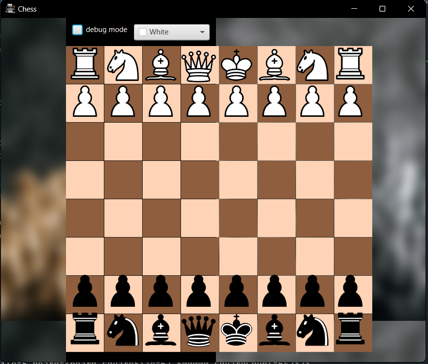

# ChessApp
A Chess Application made with JavaFX. Still a work in Progress. The plan is to make an AI that fights against the user.

here is a preview:

## Usablity

although many of the positions are illegal in a real chess match (soon to be fixed) you can still have an easy time going through positions if you know which moves occured.

## Goals

### Long term:
  - Bot support. AI versus User
  - Upgraded UI. Try to make it look nicer than just the black background

### Short term:
  - fix the coloring with the debugging option enabled
  - add castling and en passant
